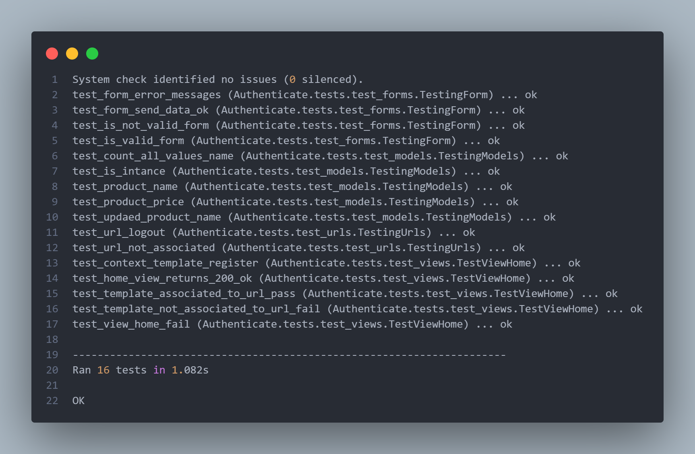
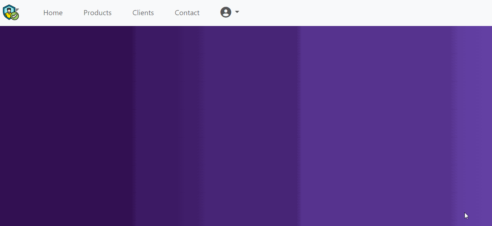
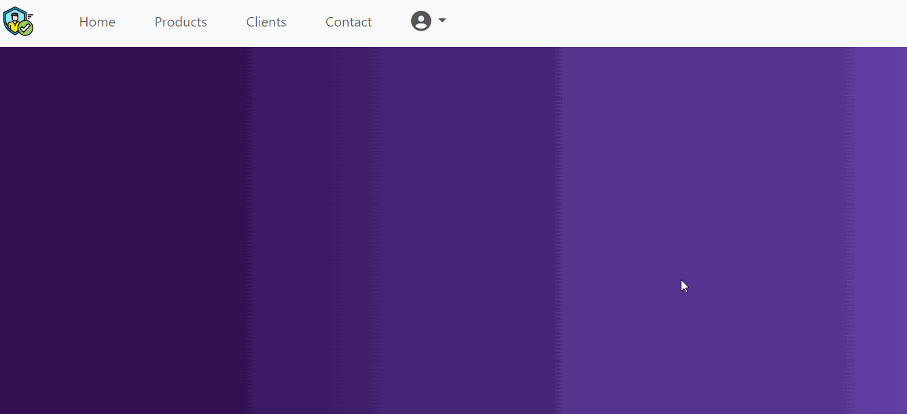
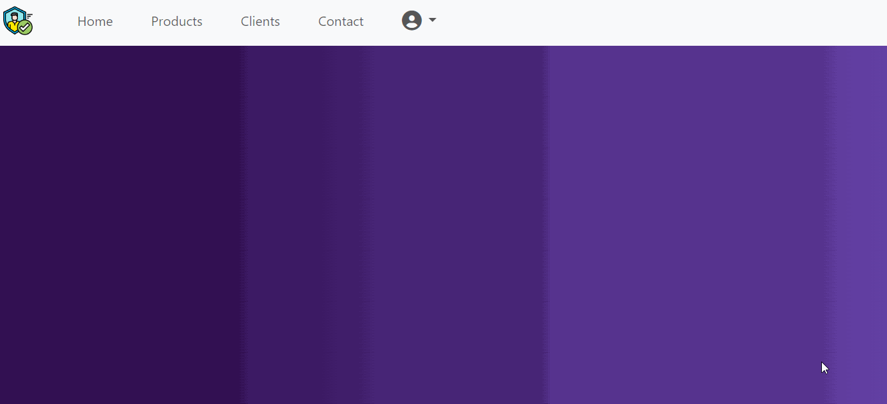

# Sistema de autenticación de usuarios

Aplicación web para el registro y autenticación, el cual permitirá llevar un control del acceso a los usuarios, cuenta con un sistema para la creación de una cuenta de usuario, inicio de sesión y un restablecedor de contraseña en caso de olvidarla, para acceder a la sección de productos el usuario deberá estar logeado.

## Tecnologías usadas

- Python versión 3.8.5
- Framework Django versión 4.2.5
- Bootstrap versión 5.3
- CSS
- HTML5

## Instalación

1. Clona este repositorio: `https://github.com/AndresSilverall/User-authentication-system.git`
2. Navega a la carpeta del proyecto: `cd User-authentication-system`
3. Ejecuta un entorno virtual de Python para la ejecución de la App

### Instalar venv en Python

- Instalar desde el gestor de paquetes de Python: `pip install venv`
- Crear un entorno virtual: `python -m venv venv`
- Navegar al entorno virtual creado: `cd venv`
- Luego ingresar a `cd Scripts`
- Presionar `activate` dentro de la carpeta `Scripts` para activar el entorno virtual
- Una vez ya activado el entorno virtual deberá volver a la carpeta raíz del proyecto
- Desde la carpeta raíz del proyecto instalar todas las dependencias de la aplicación con `pip install -r requirements.txt`

4. Ejecuta el servidor de desarrollo: `python manage.py runserver`
5. Abre tu navegador y ve a: `http://127.0.0.1:8000/`

## Pruebas de software (Unit Testing)

La aplicación cuenta con diferentes módulos como lo son los formularios, vistas, rutas (URLs), templates y modelos, para verificar el correcto funcionamiento de cada módulo por separado se aplicaron pruebas unitarias (Unit Testing), se aplicó un total de 16 de casos de pruebas, en las que se llevaron a cabo pruebas de éxito y pruebas de error.

- Aplicacion de pruebas unitarias a cada componente 

| Columna 1 | Columna 2 | Columna 3 | Columna 4 | Columna 5 |
|-----------|-----------|-----------|-----------|-----------|
| Celda 1,1ehfee | Celda 1,2 | Celda 1,3 | Celda 1,4 | Celda 1,5 |
| Celda 2,1 | Celda 2,2 | Celda 2,3 | Celda 2,4 | Celda 2,5 |
| Celda 3,1 | Celda 3,2 | Celda 3,3 | Celda 3,4 | Celda 3,5 |
| Celda 4,1 | Celda 4,2 | Celda 4,3 | Celda 4,4 | Celda 4,5 |
| Celda 5,1 | Celda 5,2 | Celda 5,3 | Celda 5,4 | Celda 5,5 |
| Celda 6,1 | Celda 6,2 | Celda 6,3 | Celda 6,4 | Celda 6,5 |
| Celda 7,1 | Celda 7,2 | Celda 7,3 | Celda 7,4 | Celda 7,5 |
| Celda 8,1 | Celda 8,2 | Celda 8,3 | Celda 8,4 | Celda 8,5 |
| Celda 9,1 | Celda 9,2 | Celda 9,3 | Celda 9,4 | Celda 9,5 |
| Celda 10,1| Celda 10,2| Celda 10,3| Celda 10,4| Celda 10,5|

## Resultados de las pruebas

## App en ejecución

### Creación de usuario

### Campos incorrectos 

### Login

### Usuario o contraseña incorrectos

### Cambiar contraseña

